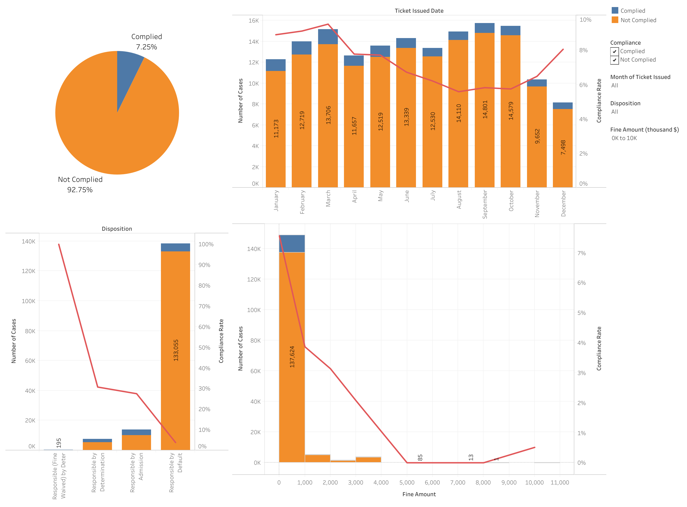

# Predict Property Maintenance Fines

Modified from the final assignment from the Applied Machine Learning in Python course. 

The files can be viewed in a Jupyter Notebook or in a html format. I don't recommend reruning the notebook on your machine, because the dataset is large, and thus training the models takes a significant amount of time.  

## Introduction
One of the most pressing problems facing Detroit is blight violations. Blight violations are issued by the city to individuals who allow their properties to remain in a deteriorated condition. Every year, the city of Detroit issues millions of dollars in fines to residents and every year, many of these fines remain unpaid. Enforcing unpaid blight fines is a costly and tedious process, so the city wants to know: how can we increase blight ticket compliance?

The first step in answering this question is understanding when and why a resident might fail to comply with a blight ticket. This is where predictive modeling comes in. 

## Overview
In this project, I focused on building classification models that best predict whether the blight tickets would be paid on time. 

First, I merged the datasets inspected the features, and discarded features that held no information or redundant information. 

Next, I built a customized transformation class to carry out a series of transformations to the data prior to traning the models. The transformations include inputing missing values, engineering datetime data, and engineering geospatial data. I then used `Pipeline` to streamline the transformations and the cross validation. I prefer doing cross validation this way to avoid data leakage. If the imputation and feature engineering is done before splitting the data into training and cross validation sets, the imputed or engineered data in the training set would contain information from the cross validation set, causing data leakage and a overoptimistic result.

Then, I tried training five classification models (`GaussianNB`, `LogisticRegression`, `RandomForestClassifier`, `GradientBoostingClassifier`, and `XGBClassifier`) using default parameters, and moved forward to hyperparameter optimization with `RandomForestClassifier` and `XGBClassifier`, which are the two that performed the best. I compared the confusion matrices before and after the optimization and discussed how the models improved. I visualized how some hyperparameters affected the Area Under ROC scores and how the ROC curves compared between the models, before and after the optimization. 

In the end, I was able to get an Area Under ROC score of **0.845** from the `RandomForestClassifier`, improved from **0.827** before the hyperparameter optimization, compared to **0.748**, obtained using the baseline model, `GaussianNB`. On the other hand, although the `XGBClassifier` performed better using default parameters, the improvement after the optimization was not significant (**0.831** to **0.835**).

## Takeaways
In this project, it appeared that the `XGBClassifier` was not very sensitive to the hyperparameter tuning. I tried varying a couple of parameters, but they didn't result in significant change to the cross validation scores. This might be due to the inherent regularization, making it perform well even using the default parameters.

On the other hand, the `RandomForestClassifier` overfitted the data pretty badly using the default parameters, giving us more space to improve by tuning the hyperparameters to reduce the model complexity. In the end, this improvement made it a better classifier for this problem than the `XGBClassifier`.

## Tableau dashboard on compliance rate
As a side project, I analyzed the data and created a dashboard using Tableau to understand how different factors correlate to the compliance rate, and thus how well they predict whether a ticket will be paid on time. The dashboard can be found [here](https://public.tableau.com/app/profile/haolihuang/viz/PropertymaintenancefineinDetroit/Dashboard), where you can apply different filters to see how they affect the trend on the compliance rate. I also put an image of the dashboard below for easy reference. I included four figures in this dashboard, and I'll go through each of them from upper-left, upper-right, lower-left, to lower-right. 

- The pie chart shows that most of the tickets are not paid on time. Because the data is imbalanced, it would be appropriate to use Area Under ROC score, instead of accuracy, to evaluate our models.

Following are two bar charts and a histogram, with complied bars stacked on top of not-complied bars. The compliance rate is shown as the red curve, corresponding to the right y-axis. 
- There are less tickets issued in November and December, perhaps due to the Holidays. There is a pronounce month-dependence on the compliance rate. The compliance rate is lowest (~6%) in August, September, and October, but highset (~10%) in March.
- Disposition also strongly predicts the compliance rate. Responsibility waived corresponds to 100% compliance because there is no fine, but it only constitutes a negligible fraction of the cases. Responsible by Default corresponds to the lowest compliance rate of only ~2%, whereas the others (Responsible by Determination and Admission) corresponds to a much higher rate of ~30%.
- The fine of most tickets is < $1000, and tickets with lower fine amount are more likely to be paid on time. 

## Future directions
- Understand how the `RandomForestClassifier` model makes predictions to draw insights about when and why a resident might fail to comply with a blight ticket.
- Some latitudes (`lat`) and longitudes (`lon`) might be misassigned. It appears that some combinations fall outside of the City of Detroit. These values can be fixed to improve the model.

